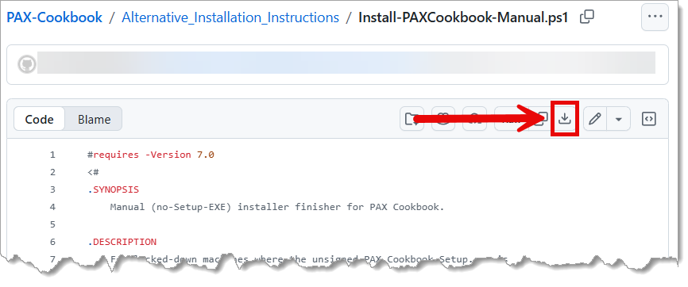
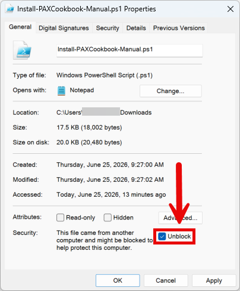
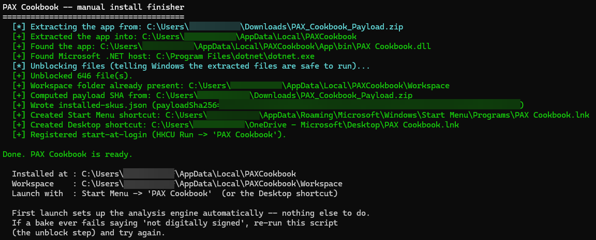
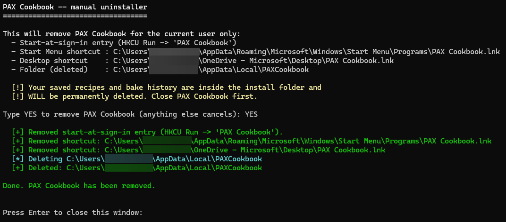

# Installing PAX Cookbook (manual setup for managed work computers)

This guide is for you if you tried to run the PAX Cookbook installer and Windows
**blocked it** with no "Run anyway" option. That happens on some company-managed
PCs that don't allow brand-new apps until they've been formally approved.

Good news: you don't need that installer. PAX Cookbook actually runs on
**Microsoft's own .NET software**, which your company almost certainly already
trusts. This guide walks you through a one-time manual setup. It takes about
10–15 minutes, and **you do not need administrator rights** for the PAX Cookbook
part (you might for the Microsoft components in Step 1, in which case ask your IT
team — these are all standard Microsoft tools they usually allow).

Take it one step at a time. You've got this.

> **The setup script:** this guide uses one small setup script —
> **[Install-PAXCookbook-Manual.ps1](https://github.com/microsoft/PAX-Cookbook/blob/main/Alternative_Installation_Instructions/Install-PAXCookbook-Manual.ps1)**.
> You'll download it in Step 3, where there's a direct link and a screenshot
> right when you need it — so you never have to go hunting for files.

---

## Step 1 — Install the free Microsoft components

PAX Cookbook relies on a few free, official Microsoft tools. These are all
**signed Microsoft installers** that your IT department typically already
permits. If any of them are already on your PC, you can skip that one.

> ### 📸 Don't worry — there are screenshots to guide you
> **You don't have to figure out the download pages on your own.** Just below
> this table you'll find a **labeled screenshot for every item**, with arrows
> and boxes pointing at the exact button or file to click. If a page looks busy
> or you're unsure which option to pick, **scroll down to the matching picture
> first** — then click with confidence.

| What it is | Why you need it | Where to get it |
|---|---|---|
| **.NET 8 Desktop Runtime** and **ASP.NET Core 8 Runtime** | The Microsoft engine that actually runs PAX Cookbook. | https://dotnet.microsoft.com/download/dotnet/8.0 — download the **Windows x64** installers for both "Desktop Runtime" and "ASP.NET Core Runtime". |
| **PowerShell 7** | A newer version of a tool that's already built into Windows; PAX Cookbook uses it to run your reports. | https://aka.ms/install-powershell — or search "PowerShell" in the Microsoft Store. |
| **WebView2 Runtime** | Lets PAX Cookbook show its window (it's the same display engine as Microsoft Edge). | https://developer.microsoft.com/en-us/microsoft-edge/webview2/?cs=1796170201&form=MA13LH#download — download the **Evergreen Standalone Installer**. (Often already installed.) |
| **Python 3.10 or newer** | Required for PAX Cookbook to run. | https://www.python.org/downloads/ — download the **Windows x64** installer, and tick “Add python.exe to PATH” during setup. |

> Tip: if a download page offers several choices, pick the **Windows x64** option.

**Where to click on each download page:**

*.NET 8 — install **both** boxed components (“ASP.NET Core Runtime” and “.NET Desktop Runtime”, Windows x64):*


*PowerShell 7 — open the **Windows** section and follow “Install PowerShell on Windows”:*


*WebView2 — download the **Evergreen Standalone Installer** (x64):*


*Python — click the **standalone installer** link for the latest Windows version:*


*Python — in the setup window, tick **“Add python.exe to PATH”**, then click **Install Now**:*


---

## Step 2 — Download PAX Cookbook

1. Go to the PAX Cookbook **Releases** page: https://github.com/microsoft/PAX-Cookbook/releases/latest
2. Under **Assets**, download the file named **`PAX_Cookbook_Payload.zip`**.

This file is just a **zip of data files**, not a program — so it won't trigger
the same block the installer did. Remember where it saved (usually your
**Downloads** folder).

*Under **Assets**, click **`PAX_Cookbook_Payload.zip`**:*


---

## Step 3 — Run the one-time setup helper

This single step does everything else for you: it unpacks the app into a tidy,
personal folder, tells Windows the files are safe, sets up your workspace, and
creates your **Start Menu and Desktop shortcuts** — and sets PAX Cookbook to
start quietly at sign-in so scheduled reports can run on their own. **You don't
need to unzip anything yourself** — the helper does it.

### 3a — Download the setup script

**[Download `Install-PAXCookbook-Manual.ps1` from GitHub →](https://github.com/microsoft/PAX-Cookbook/blob/main/Alternative_Installation_Instructions/Install-PAXCookbook-Manual.ps1)**
Click that link, then save the script into your **Downloads** folder (the same
place as the zip).

The link opens the script's page on GitHub, which only *shows* the file's text —
it doesn't download anything by itself. To actually save it, click the
**download button** (the small download-arrow icon near the top-right of the code
area, highlighted in red below), then choose your **Downloads** folder if asked.



### 3b — Unblock the script, then run it

Because you just downloaded the script, Windows tags it as "came from another
computer" and **silently refuses to run it** — if you skip this step, the
PowerShell window flashes open and closes instantly with nothing happening.
Clearing that tag once fixes it:

1. Open your **Downloads** folder and find **`Install-PAXCookbook-Manual.ps1`**.
2. **Right-click it → Properties.**
3. At the bottom of the **General** tab, if you see a checkbox labelled
   **Unblock** (next to *"This file came from another computer and might be
   blocked..."*), **tick it**, then click **OK**.
   *(No Unblock checkbox? Then Windows already trusts the file — just continue.)*



<br>

Now run it:

4. **Right-click the script again** and choose **Run with PowerShell**.
   *(On Windows 11 you may have to click **Show more options** first to see
   "Run with PowerShell".)*
5. A PowerShell window opens and runs the setup. You'll see a few green "[+]"
   lines and finally **"Done. PAX Cookbook is ready."** Press **Enter** to close
   the window.



That's it — setup is complete. By default this installs PAX Cookbook to your
personal app folder, adds a **Start Menu** and a **Desktop** shortcut, and sets
it to **start at sign-in** (so scheduled reports can run on their own).

> Still flashes and closes, even after unblocking? See **"Windows won't run the
> setup script"** in Troubleshooting below — there's a copy-paste command that
> always works.

### 3c — Prefer the command line, or want different options? (optional)

If you'd rather run it from a terminal — or want to change the defaults — open
**PowerShell** (PowerShell 7 or the built-in Windows PowerShell) and use one of
these. They all assume the script and the zip are in your **Downloads** folder.

**Default install** — Start Menu + Desktop shortcuts, and start-at-sign-in:

```powershell
pwsh -ExecutionPolicy Bypass -File "$env:USERPROFILE\Downloads\Install-PAXCookbook-Manual.ps1"
```

**No Desktop shortcut and no start-at-sign-in** (Start Menu shortcut only):

```powershell
pwsh -ExecutionPolicy Bypass -File "$env:USERPROFILE\Downloads\Install-PAXCookbook-Manual.ps1" -NoDesktop -NoAutoStart
```

**Keep the Desktop shortcut, but don't start at sign-in:**

```powershell
pwsh -ExecutionPolicy Bypass -File "$env:USERPROFILE\Downloads\Install-PAXCookbook-Manual.ps1" -NoAutoStart
```

**Start at sign-in, but skip the Desktop shortcut:**

```powershell
pwsh -ExecutionPolicy Bypass -File "$env:USERPROFILE\Downloads\Install-PAXCookbook-Manual.ps1" -NoDesktop
```

**Install to a specific folder, or point at a specific zip:**

```powershell
pwsh -ExecutionPolicy Bypass -File "$env:USERPROFILE\Downloads\Install-PAXCookbook-Manual.ps1" -InstallRoot "D:\Apps\PAXCookbook" -PayloadZip "$env:USERPROFILE\Downloads\PAX_Cookbook_Payload.zip"
```

> **What the options do:** `-NoDesktop` skips the Desktop shortcut •
> `-NoAutoStart` skips start-at-sign-in • `-InstallRoot` chooses where the app is
> installed • `-PayloadZip` points at the downloaded zip. `-ExecutionPolicy
> Bypass` simply lets this freshly downloaded script run; it applies **only to
> that one command**, never to your computer's overall settings.

---

## Step 4 — Open PAX Cookbook

Click **Start**, find **PAX Cookbook**, and click it — there's also an icon on
your **Desktop** (unless you chose to skip it). The window opens just like any
normal app.

> **Please use the shortcut to open the app** — don't double-click the file named
> `PAX Cookbook.exe` inside the App folder. That file is only there to supply the
> app's icon; opening it directly would hit the same block you saw before. The
> shortcut opens the app the approved way.

---

## Step 5 — First time you open it

- PAX Cookbook **sets up its analysis engine automatically** the first time it
  opens. You don't need to do anything — just wait a moment.
- If you ever see a one-time **"update available"** message, it's harmless and you
  can ignore it. (The setup helper normally prevents it.)

---

## Troubleshooting

**"Windows won't run the setup script."** *(PowerShell window flashes open and
closes instantly, nothing happens.)*
This means Windows is still blocking the downloaded script. First make sure you
did the **Unblock** step in **Step 3b** (right-click the script → Properties →
tick **Unblock** → OK). If it still won't run, open **PowerShell** (Start → type
*PowerShell* → Enter), paste the line below, and press **Enter** — it clears the
block and runs the setup in the window you already have open, so any message
stays visible:

```powershell
Unblock-File "$env:USERPROFILE\Downloads\Install-PAXCookbook-Manual.ps1"; & "$env:USERPROFILE\Downloads\Install-PAXCookbook-Manual.ps1"
```

**"The app opens, but when I run a report it fails saying 'not digitally signed'."**
Re-run the setup — right-click the script and choose **Run with PowerShell** again
(or use the command in Step 3c). Its first job is to mark the files as safe to
run, and that fixes this. (This can happen if the files picked up a "downloaded
from the internet" flag.)

**"It says Microsoft .NET / dotnet was not found."**
Install the **.NET 8 Desktop Runtime** and **ASP.NET Core 8 Runtime** from Step 1,
then run the setup again.

**"The window opens but stays blank or white."**
Install the **WebView2 Runtime** from Step 1 (it's what draws the window), then
reopen the app.

**"A report won't run, or the app mentions Python."**
Make sure **Python 3.10+** from Step 1 is installed, then reopen the app and try
again.

**"Where did it get installed?"**
In your personal app folder: `%LOCALAPPDATA%\PAXCookbook` (for example,
`C:\Users\YourName\AppData\Local\PAXCookbook`).

**"I want to remove it."**
Use the uninstaller — it undoes everything automatically (the shortcuts, the
start-at-sign-in entry, and all of the app's files). **[Download
`Uninstall-PAXCookbook-Manual.ps1` from GitHub →](https://github.com/microsoft/PAX-Cookbook/blob/main/Alternative_Installation_Instructions/Uninstall-PAXCookbook-Manual.ps1)**
the same way you got the setup script (open the link, then click the **download
button**). Then **right-click it → Properties → tick Unblock → OK** (same as
Step 3b), then **right-click it again** and choose **Run with PowerShell**. It
asks you to confirm, then removes PAX Cookbook for your account only — nothing
was installed system-wide.

Close PAX Cookbook first (including its system-tray icon), or some files stay
locked and you'd need to run it again. Note that this also deletes your saved
recipes and bake history. Prefer the command line?

```powershell
pwsh -ExecutionPolicy Bypass -File "$env:USERPROFILE\Downloads\Uninstall-PAXCookbook-Manual.ps1"
```

The uninstaller lists what it will remove, asks you to type **YES** to confirm,
and then reports each item it removed — ending with **"Done. PAX Cookbook has
been removed."**



---

If you get stuck on any step, send your IT contact this guide — every tool here is
a standard, signed Microsoft component, and nothing requires changing your PC's
security settings.
