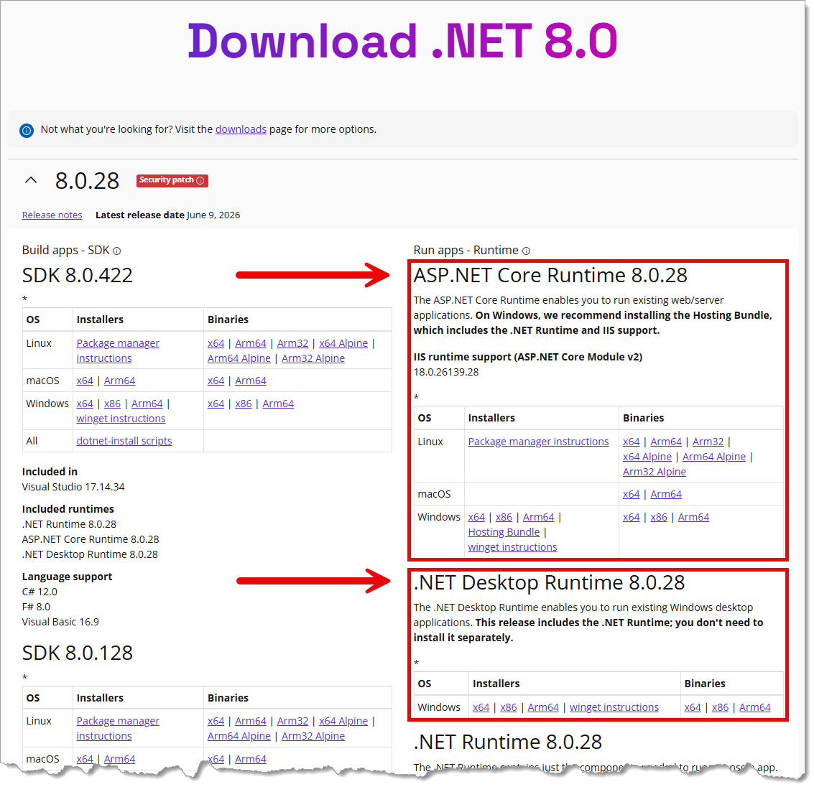
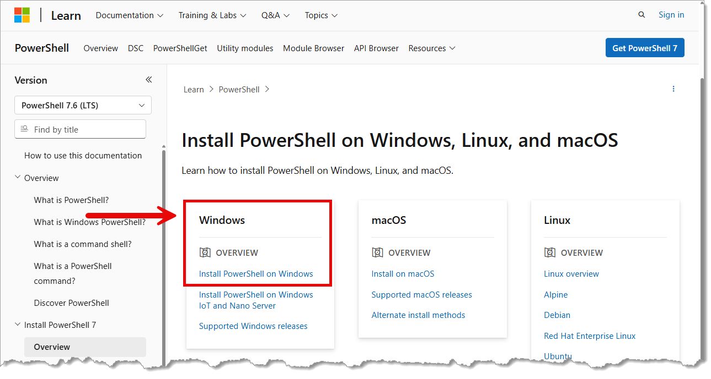
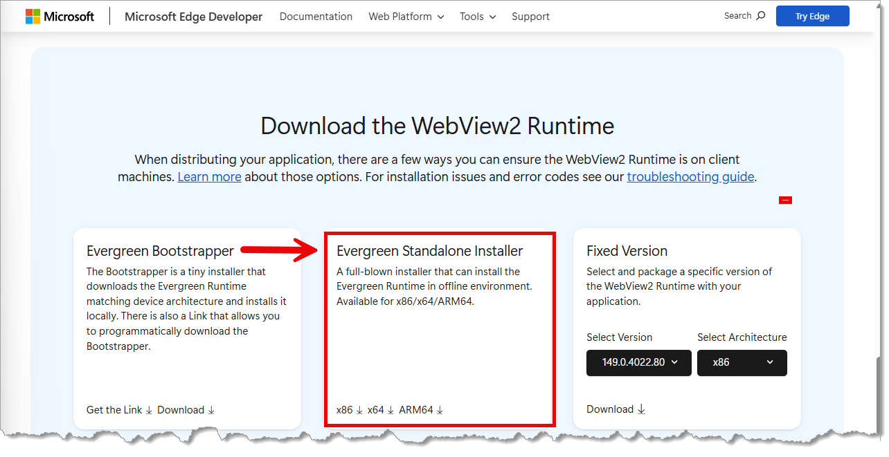
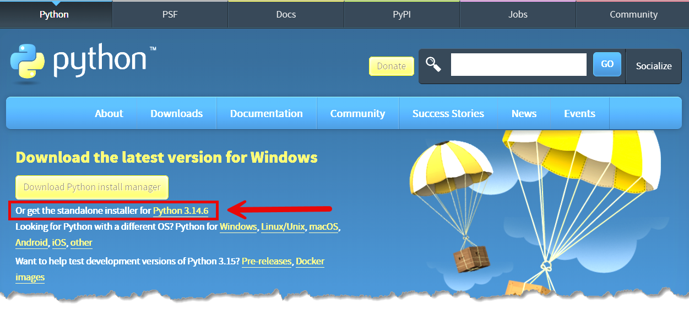
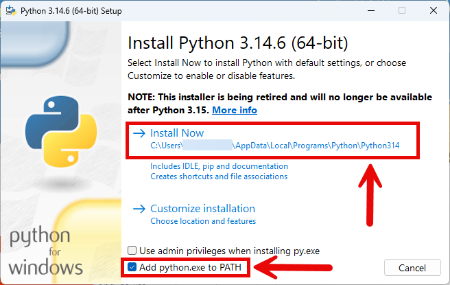
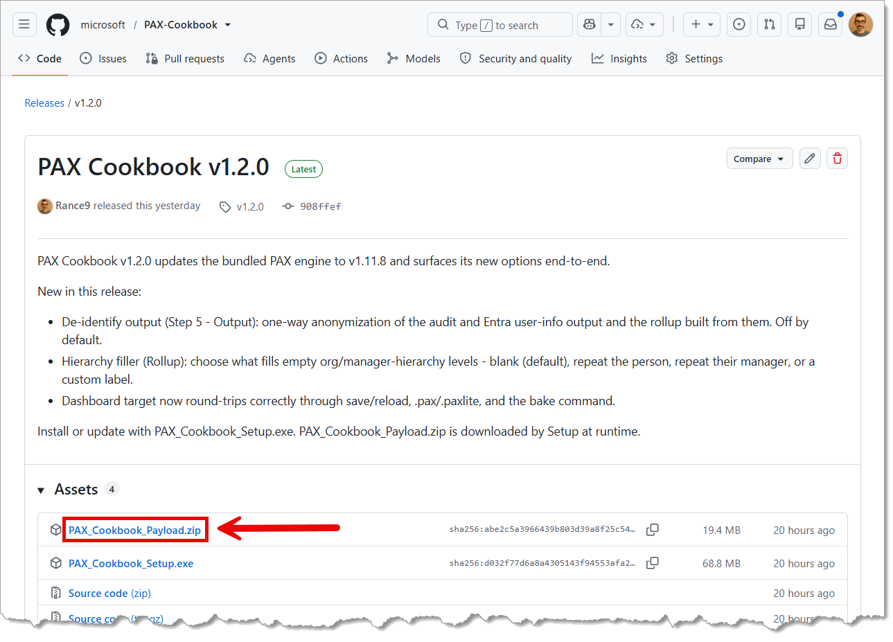

# Installing PAX Cookbook (manual setup for managed work computers)

This guide is for you if you tried to run the PAX Cookbook installer and Windows
**blocked it** with no "Run anyway" option. That happens on some company-managed
PCs that don't allow brand-new apps until they've been formally approved.

Good news: you don't need that installer. PAX Cookbook actually runs on
**Microsoft's own .NET software**, which your company almost certainly already
trusts. This guide walks you through a one-time manual setup. It takes about
10–15 minutes, and **you do not need administrator rights** for the PAX Cookbook
part (you might for the Microsoft components in Step 1, in which case ask your IT
team — these are all standard Microsoft tools they usually allow).

Take it one step at a time. You've got this.

> **Where these files live:** you're reading this in the
> **`Alternative_Installation_Instructions`** folder of the PAX Cookbook
> repository. The small setup scripts this guide uses —
> **`Install-PAXCookbook-Manual.ps1`** (and the optional
> **`Launch-PAXCookbook-Manual.ps1`**) — are in this same folder. You'll download
> the setup script in Step 3.

---

## Step 1 — Install the free Microsoft components

PAX Cookbook relies on a few free, official Microsoft tools. These are all
**signed Microsoft installers** that your IT department typically already
permits. If any of them are already on your PC, you can skip that one.

| What it is | Why you need it | Where to get it |
|---|---|---|
| **.NET 8 Desktop Runtime** and **ASP.NET Core 8 Runtime** | The Microsoft engine that actually runs PAX Cookbook. | https://dotnet.microsoft.com/download/dotnet/8.0 — download the **Windows x64** installers for both "Desktop Runtime" and "ASP.NET Core Runtime". |
| **PowerShell 7** | A newer version of a tool that's already built into Windows; used to run the one-time setup script below. | https://aka.ms/install-powershell — or search "PowerShell" in the Microsoft Store. |
| **WebView2 Runtime** | Lets PAX Cookbook show its window (it's the same display engine as Microsoft Edge). | https://developer.microsoft.com/en-us/microsoft-edge/webview2/?cs=1796170201&form=MA13LH#download — download the **Evergreen Standalone Installer**. (Often already installed.) |
| **Python 3.10 or newer** | Required for PAX Cookbook to run. | https://www.python.org/downloads/ — download the **Windows x64** installer, and tick “Add python.exe to PATH” during setup. |

> Tip: if a download page offers several choices, pick the **Windows x64** option.

**Where to click on each download page:**

*.NET 8 — install **both** boxed components (“ASP.NET Core Runtime” and “.NET Desktop Runtime”, Windows x64):*



*PowerShell 7 — open the **Windows** section and follow “Install PowerShell on Windows”:*



*WebView2 — download the **Evergreen Standalone Installer** (x64):*



*Python — click the **standalone installer** link for the latest Windows version:*



*Python — in the setup window, tick **“Add python.exe to PATH”**, then click **Install Now**:*



---

## Step 2 — Download PAX Cookbook

1. Go to the PAX Cookbook **Releases** page: https://github.com/microsoft/PAX-Cookbook/releases/latest
2. Under **Assets**, download the file named **`PAX_Cookbook_Payload.zip`**.

This file is just a **zip of data files**, not a program — so it won't trigger
the same block the installer did. Remember where it saved (usually your
**Downloads** folder).

*Under **Assets**, click **`PAX_Cookbook_Payload.zip`**:*



---

## Step 3 — Run the one-time setup helper

This single step does everything else for you: it unpacks the app into a tidy,
personal folder, tells Windows the files are safe, sets up your workspace, and
creates your Start Menu (and Desktop) shortcut. **You don't need to unzip
anything yourself** — the helper does it.

1. From **this `Alternative_Installation_Instructions` folder** (the same place
   you're reading this guide), download **`Install-PAXCookbook-Manual.ps1`** into
   your **Downloads** folder (the same place as the zip).
   *(On GitHub: click the file name to open it, then click the **Download raw
   file** button — the small download icon near the top-right of the file view.)*
2. Click **Start**, type **PowerShell 7**, and open it. (Look for the app named
   "PowerShell 7" — the icon is a dark blue terminal.)
3. **Copy the command below**, paste it into the PowerShell 7 window, and press **Enter**:

   ```powershell
   pwsh -File "$env:USERPROFILE\Downloads\Install-PAXCookbook-Manual.ps1" -InstallRoot "$env:LOCALAPPDATA\PAXCookbook" -PayloadZip "$env:USERPROFILE\Downloads\PAX_Cookbook_Payload.zip" -Desktop
   ```

   > This assumes the helper script and the zip are both in your **Downloads**
   > folder. If you saved them somewhere else, just change those two paths to
   > match. `-PayloadZip` is the zip you downloaded in Step 2; `-InstallRoot` is
   > where the app will be placed (a tidy spot in your own user folder — no admin
   > rights needed).

4. You'll see a few green "[+]" lines and finally **"Done. PAX Cookbook is ready."**
   That's it — setup is complete.

*Want it to also start quietly in the background each time you sign in (so
scheduled reports can run on their own)? Add `-EnableAutoStart` to the end of the
command. This is optional.*

---

## Step 4 — Open PAX Cookbook

Click **Start**, find **PAX Cookbook**, and click it. (If you used `-Desktop`,
there's also an icon on your Desktop.) The window opens just like any normal app.

> **Please use the shortcut to open the app** — don't double-click the file named
> `PAX Cookbook.exe` inside the App folder. That file is only there to supply the
> app's icon; opening it directly would hit the same block you saw before. The
> shortcut opens the app the approved way.

*Prefer to start the app from a script instead of the shortcut? This folder also
includes an optional **`Launch-PAXCookbook-Manual.ps1`** — download it the same
way and run it in PowerShell 7 whenever you want to open PAX Cookbook.*

---

## Step 5 — First time you open it

- PAX Cookbook **sets up its analysis engine automatically** the first time it
  opens. You don't need to do anything — just wait a moment.
- If you ever see a one-time **"update available"** message, it's harmless and you
  can ignore it. (The setup helper normally prevents it.)

---

## Troubleshooting

**"The app opens, but when I run a report it fails saying 'not digitally signed'."**
Re-run the Step 3 helper command. Its first job is to mark the files as safe to
run, and that fixes this. (This can happen if the files picked up a "downloaded
from the internet" flag during extraction.)

**"It says Microsoft .NET / dotnet was not found."**
Install the **.NET 8 Desktop Runtime** and **ASP.NET Core 8 Runtime** from Step 1,
then run the Step 3 command again.

**"The window opens but stays blank or white."**
Install the **WebView2 Runtime** from Step 1 (it's what draws the window), then
reopen the app.

**"A report won't run, or the app mentions Python."**
Make sure **Python 3.10+** from Step 1 is installed, then reopen the app and try
again.

**"Where did it get installed?"**
In your personal app folder: `%LOCALAPPDATA%\PAXCookbook` (for example,
`C:\Users\YourName\AppData\Local\PAXCookbook`).

**"I want to remove it."**
Delete the Start Menu (and Desktop) shortcut, delete the
`%LOCALAPPDATA%\PAXCookbook` folder, and — if you turned on start-at-login — open
**Task Manager → Startup**, find **PAX Cookbook**, and disable it. Nothing was
installed system-wide.

---

If you get stuck on any step, send your IT contact this guide — every tool here is
a standard, signed Microsoft component, and nothing requires changing your PC's
security settings.
